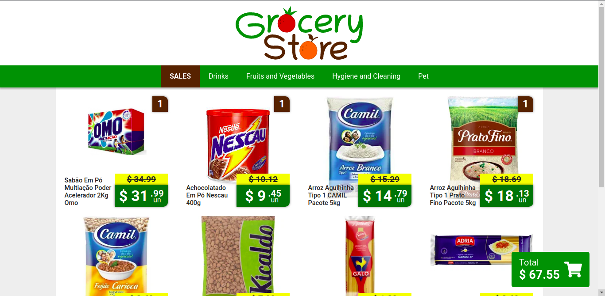

<h1 align="center">
  Grocery Store
</h1>

<h2 align="center"> :books: About </h2 align="center">

 Grocery Store front end application using NextJS. 

<h2 align="center"> :rocket: Technologies </h2>

NextJS

Redux

Sass

Jest

Eslint

Prettier

